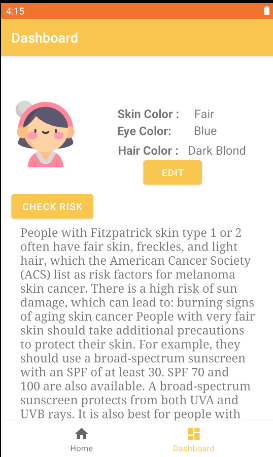
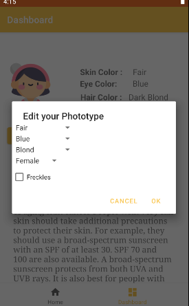
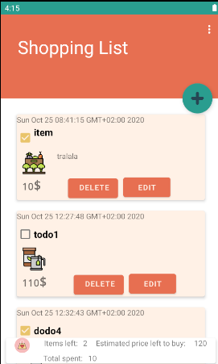
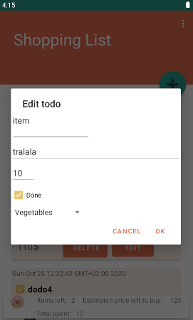
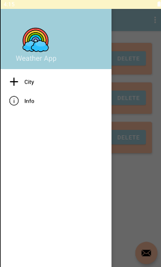
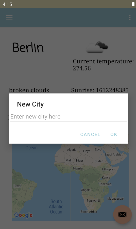
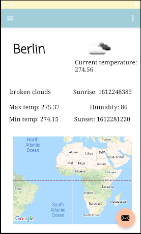

# Android-projects
A set of sample projects made in Kotlin that implement the most important concepts in android 
development:
-Recycle View
-Custom View
-Persistence (Room database)
-HTTP request 
-Complex UI (map, fragment and others)

## UV level app
This app helps to keep track of the sun activity and it displays the safe time for your 
skin to be in the sun.

##Shopping list app
Simple app to keep track of the items you need to buy and how much you will spend on them.

##Minesweeper game
Well known minesweeper game, made with a custom view.

##Weather app
An app that help you keep track of the weather in different cities.

